# Kivy compatibility

UI2 is gradually adopting useful concepts and widgets from
[Kivy](https://kivy.org/doc/stable/api-kivy.uix.html). The goal is consistent
behavior in UI2's V and QML APIs on every backend, not Python/KV source
compatibility or a copy of Kivy's default theme.

The screenshots below are generated from the runnable examples with UI2's
custom renderer.

## ProgressBar

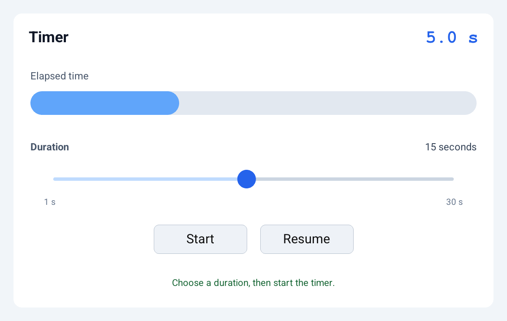

`ProgressBar` follows Kivy's horizontal, display-only behavior. `max` defaults
to 100, and `value` is clamped to `0...max`.

```qml
ProgressBar {
    id: download
    value: app.downloaded
    max: app.total
    background: #E2E8F0
    color: #2563EB
    corner_radius: 6
}
```

The equivalent V API is `progress_bar(ProgressBarConfig{...})`:

```v
bar := ui2.progress_bar(
	id: 'download'
	frame: ui2.rect(20, 20, 240, 12)
	value: downloaded
	max: total
	background: 0xe2e8f0
	color: 0x2563eb
	radius: 6
)
```

Use `progress_bar_value_normalized(value, max)` when application logic also
needs the normalized `0...1` value. A non-positive maximum produces an empty
bar instead of dividing by zero. The generated element supplies progress-bar
accessibility metadata, which can be overridden with QML's shared
`accessibility_role`, `accessibility_label`, and `accessibility_value`
properties.

## Slider

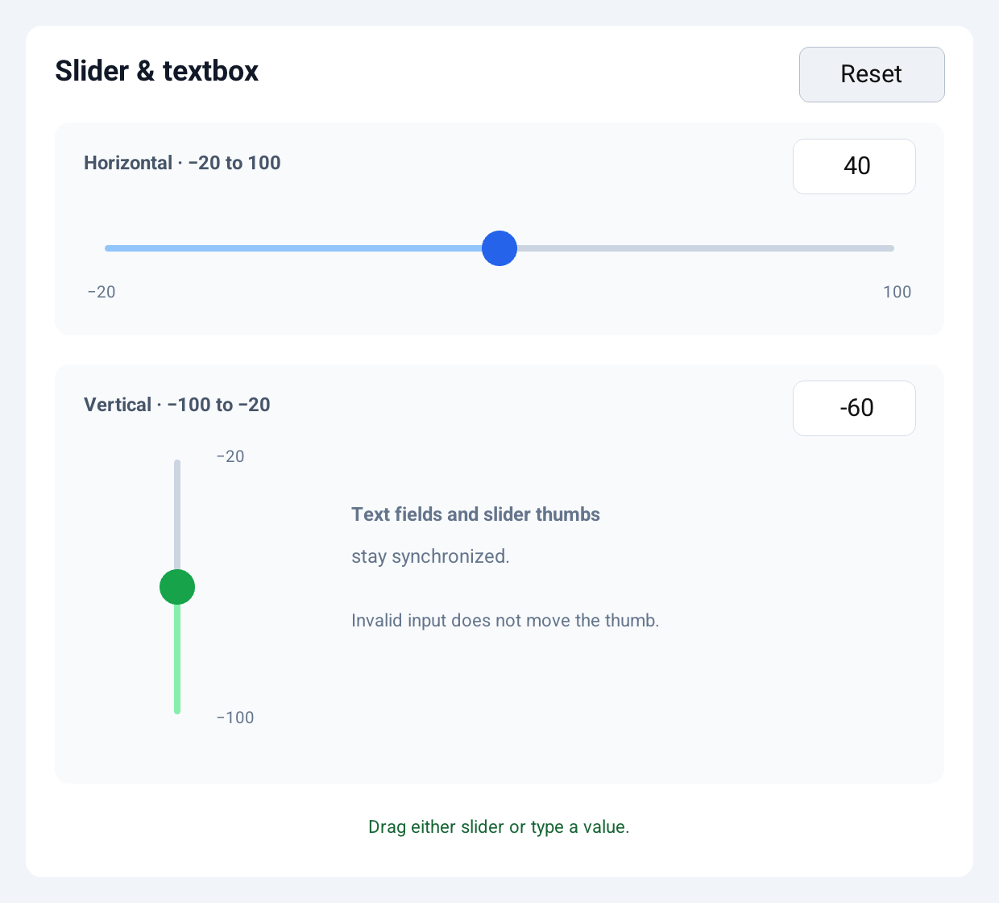

`Slider` supports horizontal and vertical orientation, arbitrary numeric
`min`/`max` ranges, optional `step` snapping, configurable track and thumb
styling, and an optional colored value track. Vertical sliders place the
minimum at the bottom and maximum at the top.

```qml
Slider {
    id: volume
    bind.value: app.volume
    min: 0
    max: 100
    step: 5
    value_track: true
    on_change: app.volume_changed()
}
```

The V constructor is `slider(SliderConfig{...})`. A stable `id` lets event
handlers read the live value with `slider_value(id)` or update it with
`set_slider_value(id, value)`. The QML model adapter supports two-way numeric
`bind.value` fields of type `int`, `f32`, or `f64`.

## Switch

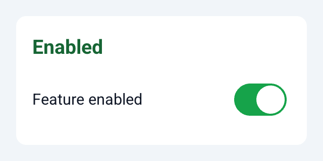

`Switch` is a reusable boolean control with tap and horizontal-drag input. Its
entire frame is interactive, while the switch chrome is centered inside it.
Native backends use their platform toggle controls where available; the custom
renderer provides matching pill-and-thumb geometry and configurable colors.

```qml
Switch {
    id: notifications
    bind.active: app.notifications_enabled
    on_active: app.save_preferences()
    active_color: #16A34A
    inactive_color: #CBD5E1
    thumb_color: #FFFFFF
}
```

The V constructor is `switch_control(SwitchConfig{...})`. A stable `id` lets
event handlers read the newly selected state with `switch_active(id)` or update
it with `set_switch_active(id, active)`. QML's `active` property defaults to
`false`, and `bind.active` accepts mutable `bool` model fields.

## Spinner

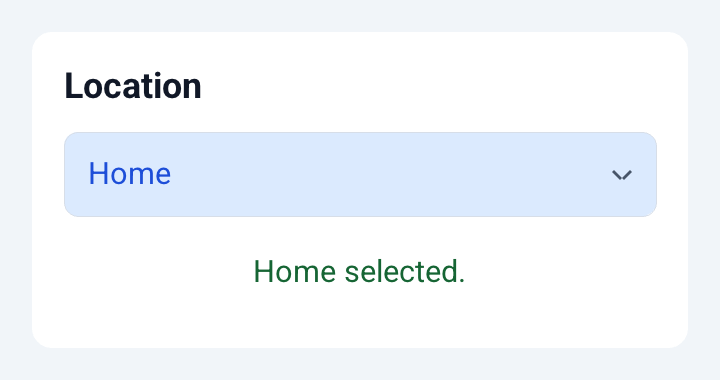

`Spinner` selects one string from a compact dropdown list. It uses the same
native and custom popup behavior as UI2's `Dropdown`, while exposing `text`,
`text_autoupdate`, and `on_text`. V supplies the `values` array directly; QML
declares each string with an `Option` child.

```qml
Spinner {
    id: location
    bind.text: app.location
    on_text: app.location_changed()
    Option { text: "Home" }
    Option { text: "Work" }
    Option { text: "Other" }
}
```

The V constructor is `spinner(SpinnerConfig{...})`. Set `text_autoupdate` to
select the first value whenever a non-empty values list is supplied. Event
handlers can read or replace the mounted selection through UI2's existing
`text(id)` and `set_text(id, value)` APIs.

## ToggleButton

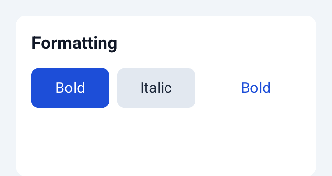

`ToggleButton` keeps a boolean pressed state after the pointer is released. It
supports distinct released and pressed colors while retaining the ordinary
button label, bounds, enabled state, and accessibility behavior.

```qml
ToggleButton {
    id: bold
    text: "Bold"
    bind.pressed: app.bold
    on_state: app.format_changed()
    background: #E2E8F0
    down_background: #1D4ED8
    down_color: #FFFFFF
}
```

The V constructor is `toggle_button(ToggleButtonConfig{...})`. During its event
callback, `toggle_button_pressed(id)` reports the new live state;
`set_toggle_button_pressed(id, pressed)` updates a mounted control. Set `group`
to the same non-empty name on multiple controls to make their pressed states
mutually exclusive. `allow_no_selection` defaults to `true`; set it to `false`
when one member must remain selected. `toggle_button_group_members(id)` returns
the mounted IDs belonging to the same group.

## GridLayout

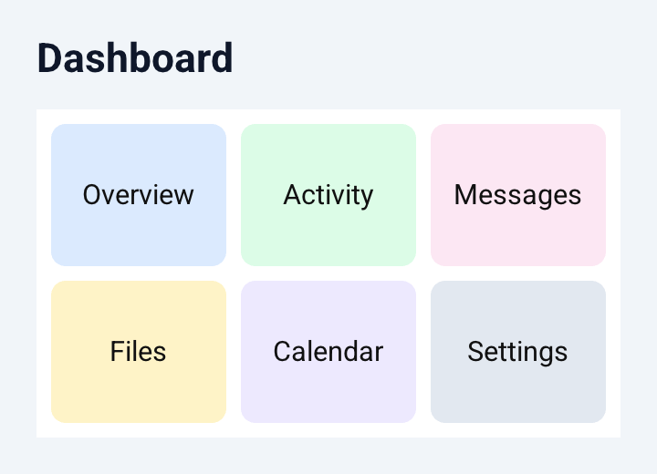

`GridLayout` assigns children to matrix cells in declaration order. At least
one of `columns`/`cols` or `rows` is required. With one constraint, the other
dimension grows to fit the children; setting both places a fixed limit on the
number of cells.

```qml
GridLayout {
    columns: 3
    padding: 8
    spacing: 8
    orientation: lr-tb
    Button { text: "One" }
    Button { text: "Two" }
    Button { text: "Three" }
}
```

The V API is `grid_layout(GridLayoutConfig{...})` and returns an error for an
invalid constraint or capacity. It supports all eight two-axis orientations,
per-edge `GridPadding`, horizontal/vertical `GridSpacing`, default or forced
row and column sizes, and per-index minimum sizes. QML also accepts
`padding_left`, `padding_top`, `padding_right`, `padding_bottom`, `spacing_x`,
`spacing_y`, `col_default_width`, `row_default_height`,
`col_force_default`, and `row_force_default`. Repeater output participates in
the same cell calculation.

## BoxLayout

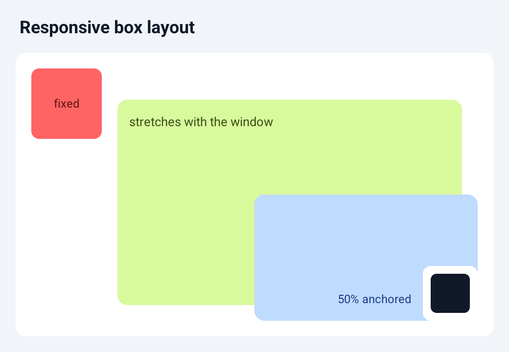

`BoxLayout` places children in a horizontal or vertical line. Fixed-size
children reserve their declared space first; the remaining main-axis space is
distributed between hinted children in proportion to their hints.

```qml
BoxLayout {
    padding: 10
    spacing: 8
    Button { text: "Fixed" width: 88 size_hint_x: -1 }
    Button { text: "Two shares" size_hint_x: 2 }
    Button { text: "One share" size_hint_x: 1 }
}
```

Use a negative `size_hint_x` or `size_hint_y` to preserve the declared size on
that axis. Non-negative hints are proportional. The matching
`size_hint_min_x`, `size_hint_min_y`, `size_hint_max_x`, and
`size_hint_max_y` properties bound the result. `align_x` and `align_y` accept
`start`, `center`, or `end` (plus edge aliases) when a child does not fill the
cross axis.

The V API uses `box_layout(BoxLayoutConfig{...})` with `BoxLayoutChild`
entries. It also exposes typed orientation, padding, alignment,
`box_layout_frames`, and `box_layout_minimum_size`. QML Repeater children can
bind every numeric size hint to model data.

## AnchorLayout

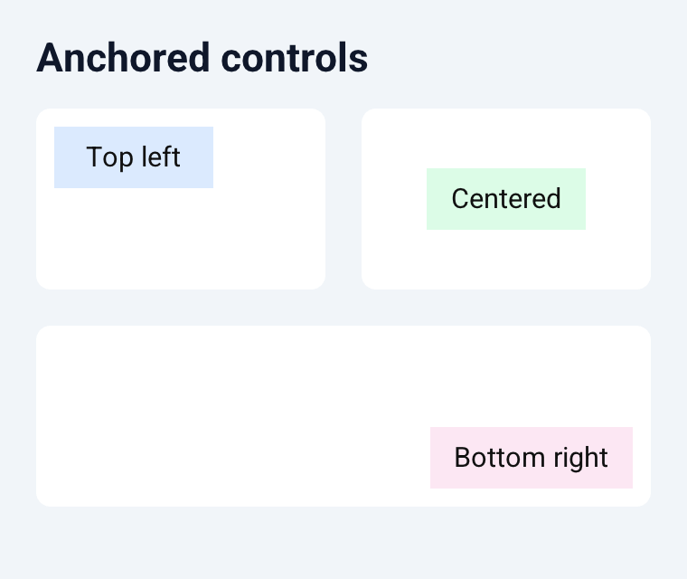

`AnchorLayout` aligns each child to the left, center, or right and independently
to the top, center, or bottom of its available bounds. Child sizes are
preserved, and padding reduces the alignment area.

```qml
AnchorLayout {
    anchor_x: right
    anchor_y: bottom
    padding: 12
    Button { text: "Continue" width: 120 height: 40 }
}
```

The V constructor is `anchor_layout(AnchorLayoutConfig{...})`, with typed
`HorizontalAnchor`, `VerticalAnchor`, and `AnchorPadding` values. QML defaults
both axes to `center` and supports a shared `padding` or the per-edge
`padding_left`, `padding_top`, `padding_right`, and `padding_bottom` properties.

## FloatLayout

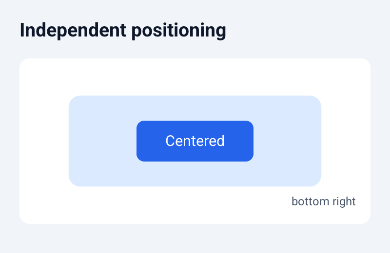

`FloatLayout` independently sizes and positions each child relative to the
container. With no position hint, a child's declared `x` and `y` are retained.

```qml
FloatLayout {
    Rectangle {
        size_hint_x: 0.6
        size_hint_y: 0.4
        pos_hint_center_x: 0.5
        pos_hint_center_y: 0.5
    }
}
```

Negative size hints preserve declared dimensions. Non-negative hints multiply
the parent dimension and can be bounded with the same `size_hint_min_*` and
`size_hint_max_*` properties as `BoxLayout`. Horizontal positioning supports
`pos_hint_x`, `pos_hint_center_x`, and `pos_hint_right`; vertical positioning
supports `pos_hint_y`/`pos_hint_top`, `pos_hint_center_y`, and
`pos_hint_bottom`. Hint coordinates follow UI2's top-left coordinate system.

The V API is `float_layout(FloatLayoutConfig{...})`. `FloatLayoutChild` uses
typed `FloatAxisHint` values with `start`, `center`, and `end` anchors, while
`float_layout_frames` exposes the pure geometry calculation. Model-driven QML
Repeater children are supported.

## RelativeLayout

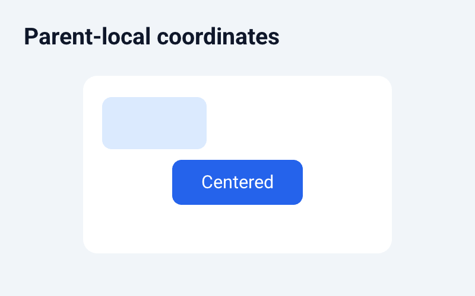

`RelativeLayout` provides the same child sizing and position hints as
`FloatLayout`, but explicitly establishes parent-local coordinates. Moving the
layout changes only its own frame; child `x` and `y` values remain relative to
the layout's origin.

```qml
RelativeLayout {
    x: 40
    y: 50
    width: 200
    height: 100
    Button {
        width: 80
        height: 30
        size_hint_x: -1
        size_hint_y: -1
        pos_hint_center_x: 0.5
        pos_hint_center_y: 0.5
    }
}
```

UI2 element children are already rendered in parent-local coordinates, so the
QML implementation shares `FloatLayout`'s hint calculation without applying
the parent's offset twice. The V API is
`relative_layout(RelativeLayoutConfig{...})`, and
`relative_layout_frames` exposes the local geometry.

## PageLayout

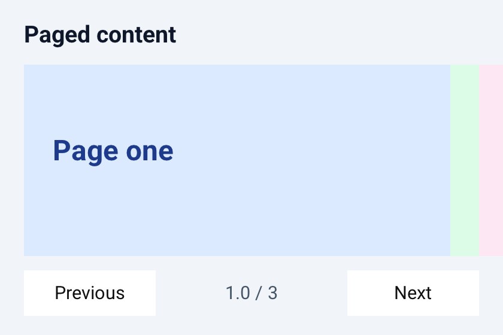

`PageLayout` presents one page with narrow border previews of adjacent pages.
The selected `page` is clamped to the available children; `border` defaults to
50 and `swipe_threshold` defaults to 0.5.

```qml
PageLayout {
    page: app.page
    border: 24
    Rectangle { Label { text: "Page one" } }
    Rectangle { Label { text: "Page two" } }
    Rectangle { Label { text: "Page three" } }
}
```

The V API is `page_layout(PageLayoutConfig{...})`. Applications can use
`page_layout_next`, `page_layout_previous`, and
`page_layout_page_after_swipe` to update their model, while
`page_layout_frames` exposes the page and border-strip geometry. Page contents
always receive the layout height and `width - border`, matching the widget's
fixed-page sizing behavior rather than child size hints.

## TextInput

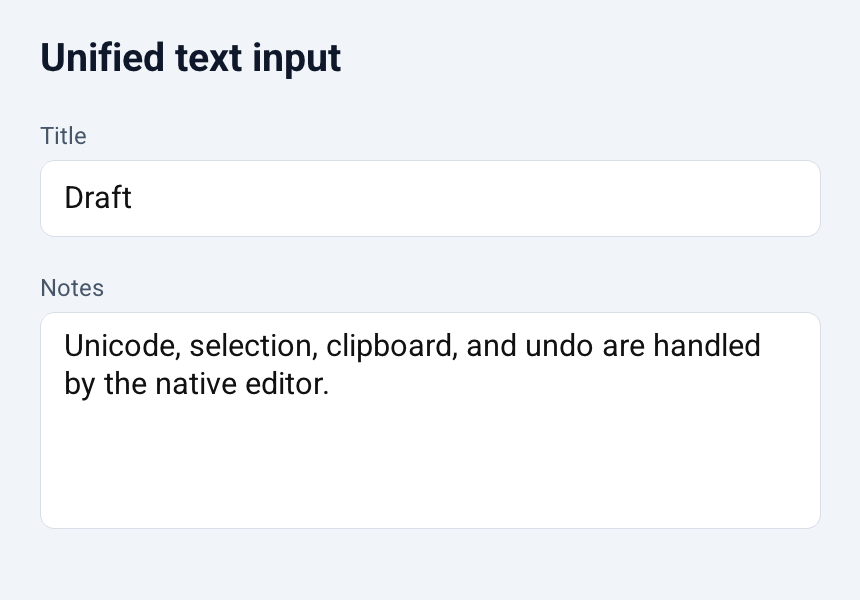

`TextInput` is a unified plain-text editor. It defaults to multiline editing;
set `multiline: false` for a compact field whose Return key emits
`on_text_validate`/`on_submit`.

```qml
TextInput {
    id: notes
    bind.text: app.notes
    hint_text: "Write notes"
    on_change: app.notes_changed()
}
```

Both modes support native Unicode editing, selection, clipboard, undo where
the backend provides it, live `bind.text`, `readonly`, `autocorrect`, styling,
and the shared `text(id)`/`set_text(id, value)` APIs. `password: true` selects
native secure entry for single-line input; multiline password mode returns an
explicit error because the native multiline editors do not provide secure
entry.

The V constructor is `text_input(TextInputConfig{...})`. `hint_text` maps to
UI2's placeholder metadata, `disable_scroll` selects an unscrolled multiline
editor, and `action_id`/`submit_id` distinguish live edits from Return-key
submission.

## TabbedPanel

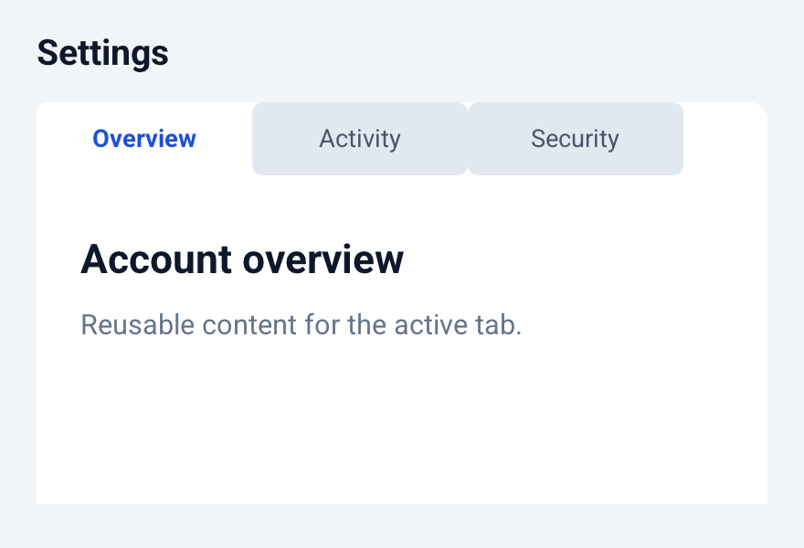

`TabbedPanel` combines a header strip with one active content area. Declare
each page as a `Tab`; its `on_select` action updates the application's current
tab model.

```qml
TabbedPanel {
    current: app.current_tab
    tab_pos: top_left
    tab_width: 100
    Tab { text: "General" on_select: app.show_general() Rectangle {} }
    Tab { text: "Account" on_select: app.show_account() Rectangle {} }
}
```

All twelve `tab_pos` values are supported: top/bottom strips aligned left,
middle, or right, and left/right strips aligned top, middle, or bottom.
`tab_height` controls strip thickness and `tab_width` controls each header's
length; set `tab_width: 0` to distribute headers evenly. Active and inactive
headers have separate background and text colors, and expose tab accessibility
state.

The V constructor is `tabbed_panel(TabbedPanelConfig{...})`, using
`TabbedPanelTab` entries. `tabbed_panel_geometry` exposes header/content frames,
and `tabbed_panel_current` clamps model indexes. Only the active tab's content
is added to the element tree.

## Accordion

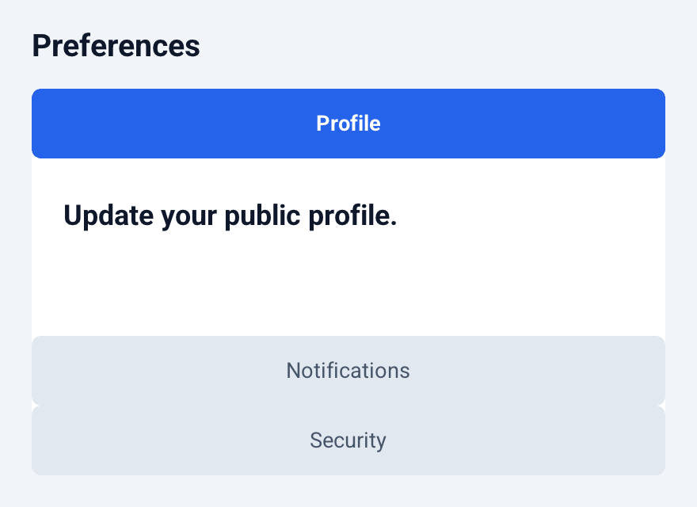

`Accordion` presents titled sections while keeping exactly one section open.
Declare sections as `AccordionItem` children and update `current` from each
item's `on_select` action.

```qml
Accordion {
    current: app.current_section
    orientation: vertical
    min_space: 40
    AccordionItem { title: "Profile" on_select: app.show_profile() Rectangle {} }
    AccordionItem { title: "Security" on_select: app.show_security() Rectangle {} }
}
```

Horizontal and vertical layouts are supported. `min_space` reserves the title
area for every item and gives all remaining space to the active item. Active
and inactive titles have separate background and text colors, disabled items
remain visible but cannot be selected, and each title exposes expanded or
collapsed accessibility state.

The V constructor is `accordion(AccordionConfig{...})`, using `AccordionItem`
entries. `accordion_geometry` exposes item, title, and content frames, while
`accordion_current` clamps model indexes. Only the active item's content is
added to the element tree.

## TreeView

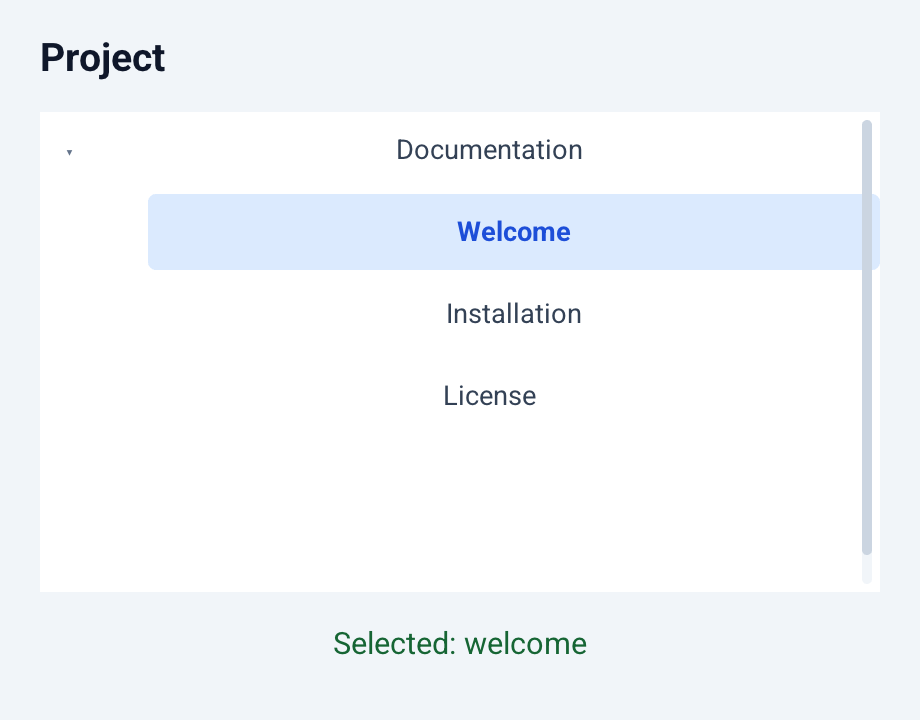

`TreeView` renders hierarchical `TreeNode` declarations as indented rows.
Expanded state controls which descendants are visible; applications update
that state with `on_toggle` and track the active leaf with `on_select`.

```qml
TreeView {
    TreeNode {
        text: "Documentation"
        expanded: app.docs_open
        on_toggle: app.toggle_docs()
        TreeNode {
            text: "Guide"
            selected: app.selected == "guide"
            on_select: app.select_guide()
        }
    }
}
```

`row_height`, `spacing`, `indent`, and `disclosure_width` control geometry.
Normal and selected rows have independent background/text colors. Branch
disclosures announce expanded/collapsed state, selectable rows expose tree-item
accessibility state, and disabled nodes remain visible without accepting input.

The V constructor is `tree_view(TreeViewConfig{...})`, using recursive
`TreeViewNode` entries. `tree_view_rows` returns the flattened visible hierarchy
with depth and row frames; `tree_view_content_height` is useful when placing the
tree inside a `Scroll` container.

## ScreenManager

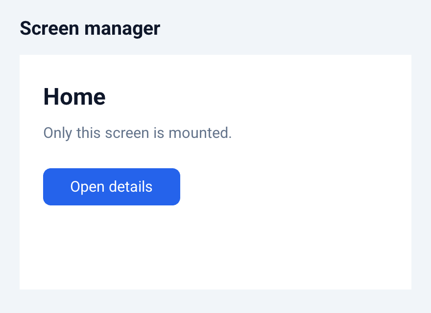

`ScreenManager` owns named screens and adds only the active screen to the
element tree. `current` may use a screen's `name` property or its `id`; an empty
value selects the first declared screen.

```qml
ScreenManager {
    current: app.current_screen
    Screen {
        id: home
        Button { text: "Details" on_tap: app.show_details() }
    }
    Screen {
        id: details
        Label { text: "Details" }
    }
}
```

Each active screen receives the manager's full local bounds. Unknown current
names, duplicate names, and empty names are rejected so navigation failures do
not silently render the wrong content. `ManagedScreen` and `ScreenView` are
accepted as declarative aliases when a nested `Screen` would be unclear.

The V constructor is `screen_manager(ScreenManagerConfig{...})`, using
`ManagedScreen` entries. `screen_manager_current` returns the resolved name,
and `screen_manager_next`/`screen_manager_previous` provide wraparound
navigation. Animated transitions are a separate future layer; current screen
changes are immediate and deterministic on every backend.

## Carousel

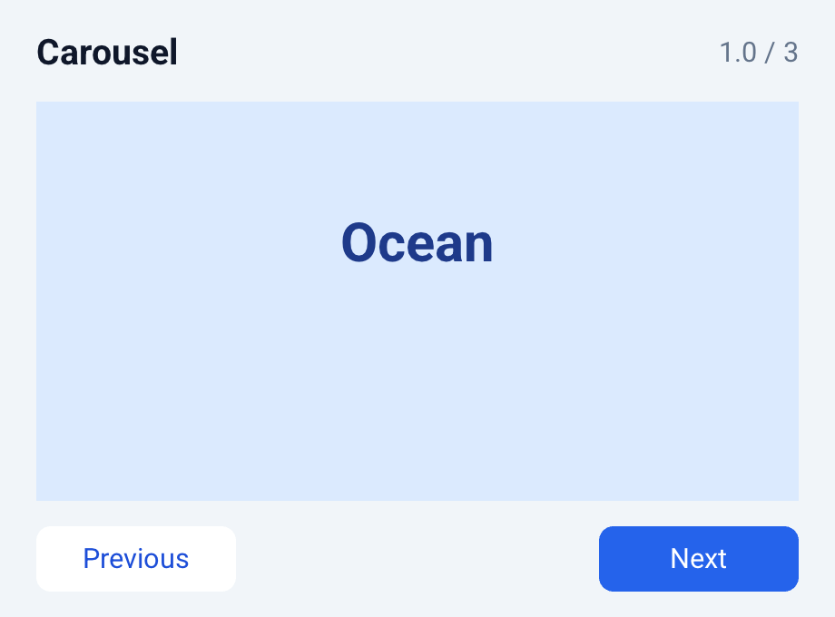

`Carousel` presents full-size slides in a horizontal or vertical sequence.
The `index` selects the visible slide, `direction` accepts `right`, `left`,
`top`, or `bottom`, and `loop` controls whether navigation wraps at the ends.

```qml
Carousel {
    index: app.slide
    direction: right
    loop: true
    CarouselSlide { Image { source: "first.png" } }
    CarouselSlide { Image { source: "second.png" } }
}
```

Inactive slides retain directional offscreen geometry but are hidden, so their
native controls cannot receive input or draw beyond the carousel bounds.
`Slide` is accepted as a shorter alias for `CarouselSlide`; ordinary direct
children can also be used as slides.

The V constructor is `carousel(CarouselConfig{...})`. `carousel_next`,
`carousel_previous`, and `carousel_index` implement bounded or wraparound
navigation. `carousel_index_after_swipe` resolves horizontal and vertical
drags using `min_move` and optional perpendicular-swipe filtering, while
`carousel_frames` exposes the directional neighbor geometry. Animated movement
and continuous drag tracking remain a future interaction layer.

## ModalView

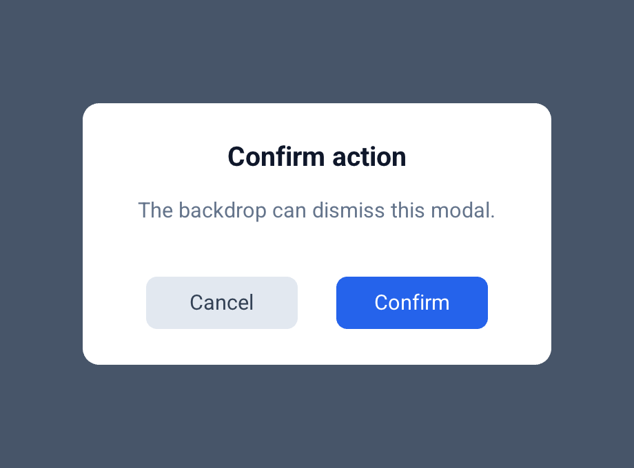

`ModalView` conditionally mounts a centered content surface over a full-size
input-blocking backdrop. It defaults to 80% of the available width and height;
fixed `content_width`/`content_height` values override those hints and clamp to
the available bounds.

```qml
ModalView {
    open: app.confirming
    on_dismiss: app.close_confirmation()
    content_width: 320
    content_height: 180
    Label { text: "Continue?" }
}
```

`auto_dismiss` defaults to `true`. The backdrop invokes `on_dismiss` only when
automatic dismissal is enabled, while a separate surface layer consumes clicks
inside blank content space. Child controls render above that blocker and remain
fully interactive. Closed modals keep their whole subtree hidden, and the root
exposes dialog accessibility semantics.

The V constructor is `modal_view(ModalViewConfig{...})` and
`modal_view_geometry` exposes the responsive overlay/content frames. Opening
and closing are model-driven and immediate; fade animations and Escape-key
dismissal remain future layers.

## Popup

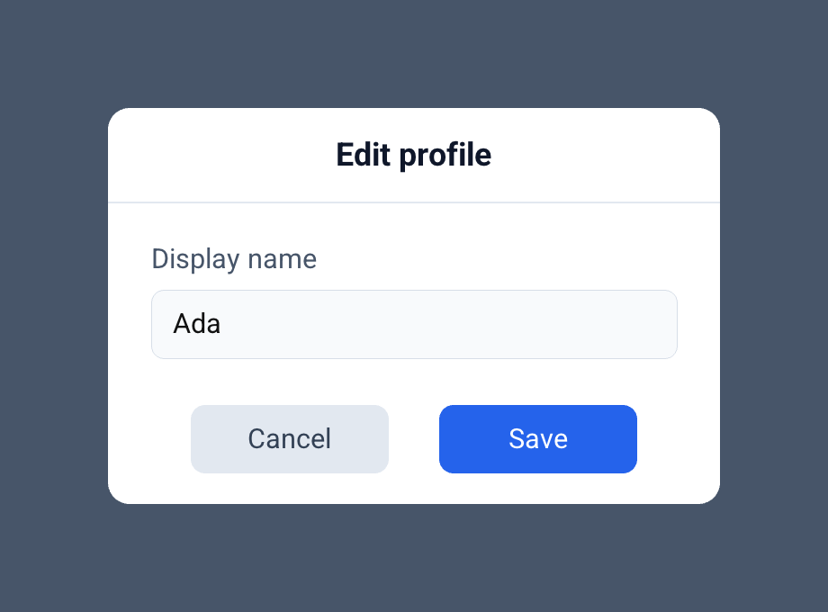

`Popup` composes `ModalView` with a title header, separator, and body area. It
shares the modal's responsive sizing, backdrop input blocking, open state,
automatic outside dismissal, and `on_dismiss` action.

```qml
Popup {
    open: app.editing
    title: "Edit profile"
    on_dismiss: app.close_editor()
    content_width: 360
    content_height: 240
    ProfileForm {}
}
```

`title_height` and `separator_height` reserve body space and are validated
against the resolved surface height. Title font/color and separator color are
independently configurable; declared children are laid out in the remaining
body-local bounds.

The V constructor is `popup(PopupConfig{...})`. `popup_geometry` returns the
overlay, centered surface, title, separator, and body frames. Popup opening and
closing are state-driven on every backend.

## StackLayout

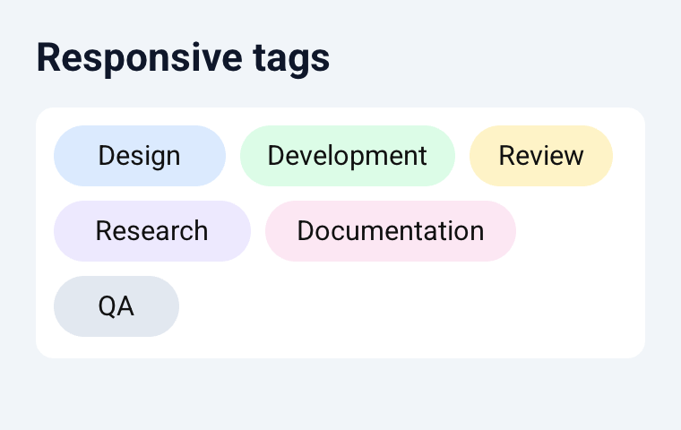

`StackLayout` packs variable-size children along one axis and wraps them when
the next child would cross the available inner width or height.

```qml
StackLayout {
    orientation: lr-tb
    padding: 10
    spacing: 8
    Button { text: "Short" width: 80 height: 32 }
    Button { text: "A wider item" width: 140 height: 32 }
}
```

The V constructor is `stack_layout(StackLayoutConfig{...})`; child widths and
heights are preserved while their positions are replaced. All eight two-axis
orientations are supported through `StackOrientation`. `StackPadding` and
`StackSpacing` provide per-edge and per-axis control, and
`stack_layout_minimum_size` reports the occupied dimensions for the current
wrap. QML supports the matching `padding_*` and `spacing_x`/`spacing_y`
properties, including model-driven Repeater child sizes.
